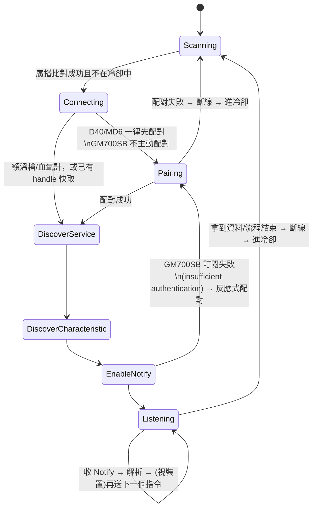

# 藍牙連接與資料協定說明

## 0. 這份文件是給誰看的

這份文件把 `pico-vitals-gateway` 韌體裡「怎麼用藍牙連上生理量測裝置、怎麼解析收到的資料」整理成平台無關的協定說明，讓其他 AI／其他平台（例如手機瀏覽器的 Web Bluetooth、原生 App 的 BLE API）可以照著重新實作一套等效的連線邏輯，**不需要讀 C 原始碼**。

原始實作在：
- [src/mode_ble_receive.c](src/mode_ble_receive.c) / [src/mode_ble_receive.h](src/mode_ble_receive.h) — 連線狀態機、掃描/連線/配對/訂閱/收資料流程
- [src/fora_protocol.c](src/fora_protocol.c) / [src/fora_protocol.h](src/fora_protocol.h) — FORA 系列裝置的封包格式
- [src/rightest_protocol.c](src/rightest_protocol.c) / [src/rightest_protocol.h](src/rightest_protocol.h) — Bionime Rightest GM700SB 血糖機的封包格式
- [src/common.h](src/common.h) — 共用資料型別

原韌體用 BTstack（C）在 Raspberry Pi Pico W 上實作 BLE **central**（主控端）角色。移植到瀏覽器時，瀏覽器透過 [Web Bluetooth API](https://developer.mozilla.org/en-US/docs/Web/API/Web_Bluetooth_API) 扮演一樣的 central 角色，概念可以直接對應，只是 API 呼叫方式不同（見第 9 節）。

---

## 1. 整體流程總覽

裝置（額溫槍、血氧計、血壓計、血糖機…）都是「量一次、短暫廣播/連線、傳完資料就傾向斷線或休眠」的被動周邊（peripheral）。閘道端（Pico，或未來的瀏覽器頁面）的角色永遠是：

```
持續掃描廣播封包
  → 用「裝置名稱關鍵字」或「Service UUID」比對出裝置種類
  → 建立連線
  → （某些裝置）先配對 / 建立加密連線
  → 探索 GATT service / characteristic（或用已知的 UUID 直接查）
  → 訂閱 Notify（寫入 CCCD）
  → 主動寫入觸發/查詢指令（或等待裝置自動推播）
  → 收到 Notify → 解析成生理數值
  → 斷線，進入該裝置種類的冷卻時間，回到「持續掃描」
```

每種裝置各自有「連線後多久內不要再連同一種裝置」的冷卻時間（讓裝置有機會走它自己的休眠邏輯），細節見第 5.5 節。**同一時間永遠只維持一條 BLE 連線**——原韌體是單工的：掃描時不接受連線，連線中不掃描。

---

## 2. 支援裝置一覽

| 裝置 | 廠牌/型號關鍵字 | 識別方式 | GATT pipe | 是否需配對 | 資料型態 |
|---|---|---|---|---|---|
| 額溫槍 | FORA IR42 | 廣播名稱含 `FORA` 且含 `IR42` | FORA 自訂 128-bit UUID | 否 | 體溫 |
| 血氧計 | FORA O2 | 廣播名稱含 `FORA` 且含 `O2` | FORA 自訂 128-bit UUID | 否 | SpO2、脈搏 |
| 血壓計 | FORA D40 | 廣播名稱含 `FORA` 且含 `D40` | FORA 自訂 128-bit UUID | **是** | 收縮壓/舒張壓/脈搏，**或**血糖（同一台裝置回應格式決定） |
| 六合一測試儀 | FORA MD6 | 廣播名稱含 `FORA` 且含 `MD6` | FORA 自訂 128-bit UUID（跟 D40 完全共用同一套指令） | **是** | 血糖/HCT/酮體/尿酸/總膽固醇/血紅素 |
| 血糖機 | Bionime Rightest GM700SB | 廣播封包 16-bit Service UUID 列表含 `0xFEE0`（廣播名稱是裝置序號，無法用名稱判斷） | 自訂 Service `0xFEE0`（Dialog Semiconductor DA1458x 晶片，跟 FORA 系列完全不同協定） | **是**（裝置用 ATT 層錯誤反應式要求加密） | 血糖 |

FORA 四種裝置雖然關鍵字不同，但走的是**同一個** GATT service/characteristic UUID（見第 5 節），連線階段光靠廣播名稱就能分辨型號；GM700SB 是完全不同廠牌/晶片，走另一組 UUID。

---

## 3. 掃描與裝置識別

- 使用**主動掃描**（active scan，會送 `SCAN_REQ` 換 `SCAN_RESPONSE`）：很多裝置把裝置名稱放在 scan response 而非主廣播封包，被動掃描會看不到名稱。
- 掃描參數：interval=48ms、window=48ms（原始值 `0x0030` = 48 個 0.625ms 單位）。
- 逐一檢查每個廣播封包的 AD structure：
  - `Complete/Shortened Local Name`（AD type `0x09`/`0x08`）→ 子字串比對 `FORA`，再比對 `O2`/`D40`/`IR42`/`MD6` 決定子型號。**四個關鍵字都比對不到時，即使名稱含 `FORA` 也視為不認得的裝置、不連線**——曾經發生過名稱含 FORA 但型號比對不出來、被舊版邏輯誤判成額溫槍、把別種裝置的回應誤解析成一筆體溫讀值上傳出去的事故，移植時務必保留這個「四選一都比對不到就放棄」的嚴格判斷。
  - `Incomplete/Complete List of 16-bit Service UUIDs`（AD type `0x02`/`0x03`）→ 檢查有沒有列出 `0xFEE0` 判斷是不是 GM700SB。
- 找到符合的裝置後：停止掃描 → `connect(address, address_type)`。
- 冷卻中的裝置種類（見第 5.5 節）即使掃到也略過，不觸發連線。

已知裝置範例位址（僅供除錯比對，不是判斷邏輯的一部分）：FORA IR42 額溫槍實機位址 `C0:26:DA:28:B6:E6`。

---

## 4. 連線狀態機



要點：
- **一次只有一個 in-flight 的 ATT 請求**：同一條連線不能同時送出兩個 write/query，必須等上一個的回應（`GATT_EVENT_QUERY_COMPLETE` 或對應 Notify）回來才送下一個。GM700SB 這點特別嚴格，實機測試證實同時送兩個請求會卡住。
- 服務/特徵值探索是可以省略的最佳化：FORA 系列裝置的 GATT attribute table 在多次連線之間固定不變，探索一次後可以把 handle 快取起來，下次連線直接跳去訂閱 Notify，省掉往返時間（FORA 裝置量完就急著斷線，時間很緊迫）。GM700SB 每次都重新探索（它不像 FORA 那樣急著斷線）。
- 連線失敗（timeout、裝置離開範圍）要視為「不會再有 disconnect 事件」，直接恢復掃描，不要卡在 Connecting 狀態。

---

## 5. FORA 系列協定（IR42 / O2 / D40 / MD6）

### 5.1 GATT UUID

實際傳資料走的不是裝置宣告的標準 Health Thermometer service（`0x1809`），而是 Nordic「LED/Button Service」風格的自訂 128-bit UUID pipe：

```
Service UUID:        00001523-1212-efde-1523-785feabcd123
Characteristic UUID: 00001524-1212-efde-1523-785feabcd123   （Write + Notify，同一個 characteristic 兼兩種屬性）
```

四種裝置（IR42/O2/D40/MD6）都用同一組 UUID，差別只在連線後的通訊內容。

### 5.2 訂閱與觸發

1. 對該 characteristic 寫入 CCCD（Client Characteristic Configuration Descriptor）開啟 Notify。
2. **裝置訂閱成功後不會自動推播**，必須主動寫入一個「觸發指令」，裝置才會回傳目前量到的數值：
   - 額溫槍/血氧計：寫入固定 8 bytes 觸發指令 `51 26 00 00 00 00 A3 1A`（write-without-response 即可，不用等 ATT 回應）。
   - D40/MD6：改送「問記錄」指令（見 5.4），不是這個固定觸發指令。

### 5.3 額溫槍 / 血氧計回應格式

收到的 Notify payload：`byte[0] == 0x51` 才是有效回應，其餘忽略。

**額溫槍**（1 筆讀值）：
```
溫度(°C) = ( (byte[3]<<8 | byte[2]) & 0x0FFF ) / 10.0
```

**血氧計**（2 筆讀值，夾手指持續量測，見 5.5 的觀察視窗策略）：
```
SpO2(%)      = (byte[3]<<8 | byte[2]) & 0x0FFF      （不除 10，整數百分比）
脈搏(bpm)    = byte[5]
```
這兩種裝置的回應不含量測時間戳，去重邏輯只能靠「數值相同 + 短時間內」的經驗法則（見第 7 節 `device_measured_key`）。

### 5.4 D40 血壓計 / MD6 六合一：「問記錄」指令協定

D40（血壓/血糖二合一）跟 MD6（六合一）走**完全相同**的底層指令通道，只是回應內容的欄位語意不同。跟額溫槍/血氧計不同，這兩台裝置**需要先配對**（Just Works，見第 8 節）才能訂閱/寫入成功。

#### 指令格式（App → 裝置，8 bytes，寫入同一個 characteristic）

```
[0]=0x51  [1]=cmd  [2]=p1  [3]=p2  [4]=p3  [5]=p4(使用者編號)  [6]=0xA3  [7]=checksum
checksum = (byte[0]+...+byte[6]) & 0xFF
```

常用指令碼：

| cmd | 用途 |
|---|---|
| `0x25` | 取得目前記錄的 Part A（回應取 byte[2..5]） |
| `0x26` | 取得目前記錄的 Part B（回應取 byte[2..5]） |
| `0x2B` | 查詢目前記錄總筆數（回應 `byte[2] | byte[3]<<8` = 筆數） |

`p1`/`p2` 平時固定填 `0x00`；要翻頁讀「非目前這一筆」的舊記錄時，把 16-bit 小端的 index 塞進 `p1`(低位)/`p2`(高位)，`p3` 固定 `0x00`，`p4` 固定使用者編號 `0x00`（目前這一筆固定用 `index=0`）。

#### 讀一筆記錄的完整流程

```
1. 送 cmd=0x25, p1/p2=index的低/高位元組  → 收到 Notify，取 value[2..5] 存成 part A（4 bytes）
2. 送 cmd=0x26, 同樣的 p1/p2               → 收到 Notify，取 value[2..5] 存成 part B（4 bytes）
3. 把 part A + part B 接成 8 bytes = 一筆完整記錄，送去下面的欄位解析
```

（連線一開始一定先用 `index=0` 讀「目前這一筆」；讀完可選擇性地繼續往回翻頁讀 `index=1,2,3...` 抓同一次連線視窗內裝置回報的其他記錄，見下面「往回翻頁」小節。）

#### 8-byte 記錄欄位佈局（D40/MD6 共用）

```
byte[0] = day(bits0-4) | month 低3bit(bits5-7)
byte[1] = month 最高1bit(bit0) | year_offset(bits1-7)，year = year_offset + 2000
byte[2] = minute(bits0-5) | 心律不整旗標(bit6) | 記錄類型旗標(bit7，只有 D40 用得到：0=血糖 1=血壓)
byte[3] = hour(bits0-4) | IHB狀態(bits5-6) | 是否為平均值(bit7)
byte[4..7] = 依裝置/類型而定，見下面分別說明
```

**D40 血壓（byte[2] bit7 == 1）**：
```
byte[4] = 收縮壓 (mmHg，整數)
byte[5] = 平均壓（不使用）
byte[6] = 舒張壓 (mmHg，整數)
byte[7] = 脈搏 (bpm，整數)
```

**D40 血糖（byte[2] bit7 == 0）**：
```
byte[4..5] = 血糖值，16-bit 小端：glucose = byte[5]*256 + byte[4]，單位 mg/dL
             65535 或 255 視為無效讀值，不當一筆記錄回傳
byte[6]    = 環境溫度（不使用）
byte[7]    = codeNo(bits0-5，不使用) | 量測情境(bits6-7，見下方「量測情境」)
```

**MD6（byte[4..7] 用途跟 D40 完全不同）**：
```
byte[4..5] = raw_value，16-bit 小端；65535 或 255 視為無效讀值
byte[7] bits2-5 = 項目代碼（決定這筆是哪一種量測項目）：
    0 = 血糖 (GLUCOSE)
    6 = HCT  血球比容 (%)
    7 = KETONE 酮體 (mmol/L)
    8 = UA    尿酸 (mg/dL)
    9 = CHOL  總膽固醇 (mg/dL)
    11 = HB   血紅素 (g/dL)
    其餘代碼（例如乳酸/三酸甘油脂用的 12/13）MD6 不會用到，遇到直接丟棄不回傳
byte[7] bits6-7 = 量測情境，見下方
raw_value 目前直接當數值使用、不縮放（血糖已實機驗證正確，其餘 5 項未逐一驗證）
特例：項目代碼==HCT 時，額外算一筆「估計血紅素」= HCT數值 × 0.34，
      標成 VITAL_TYPE_HB 一起回傳（因為裝置沒有獨立的 Hb BLE 記錄可查，
      但裝置螢幕會跟 HCT 一起顯示這個換算值，兩個實機樣本驗證公式吻合）
```

**量測情境**（`byte[7]` 高 2 bit，D40 血糖、MD6 共用同一套）：
```
0 = 一般
1 = 飯前 (AC)
2 = 飯後 (PC)
3 = QC（品管/對照液測試，不是病人數值）
```
**QC 過濾規則**：只有「血糖」這個項目在情境碼 == 3 時要整筆丟棄、不當成一筆記錄回傳；MD6 其餘 5 項（HCT/酮體/尿酸/總膽固醇/血紅素）**不**套用這個過濾（2026-08-26 已用實機螢幕核對過，情境碼對那 5 項不代表真的做了品管測試）。

#### 往回翻頁（backfill）

D40/MD6 讀完「目前這一筆」（`index=0`）並確認是新資料後，可以趁還沒斷線，繼續送 `cmd=0x2B` 問總筆數，然後從 `index=1` 開始依序讀到 `min(總筆數, 安全上限)`，把同一次連線視窗內裝置回報的其他記錄（例如同一次測試 session 的另一項數值）一起抓完。停止條件：連續 2 筆解析失敗，或翻到「跟上次同步的最後一筆記錄原始 8 bytes 完全相同」的那一筆（代表更舊的都同步過了），或抓到總筆數上限。這是一個效能最佳化步驟，非必要不用第一版就實作。

### 5.5 冷卻時間（避免連續打擾同一台裝置）

拿到讀值（或決定沒有新資料）之後，同一種裝置在下列時間內不要再嘗試連線：

| 裝置 | 冷卻時間 | 理由 |
|---|---|---|
| 額溫槍 | 60 秒 | 官方休眠門檻 1 分鐘 |
| 血壓計 D40 | 200 秒 | 官方休眠門檻 180 秒 + 20 秒餘裕 |
| MD6 | 10 秒 | 沒有休眠門檻限制，方便連續測試 |
| GM700SB | 10 秒 | 同上（猜測值，未實機驗證） |
| 血氧計 | 動態（見下） | 持續量測型裝置，見下方觀察視窗 |

**血氧計是夾手指持續量測的裝置**，跟其他「量一次就結束」的裝置不同：手指沒拿開，裝置可能一直有新讀值推上來。做法是用一個 **30 秒觀察視窗**：視窗期間每次收到新讀值就覆蓋掉候選值（只保留最新一筆），期間用 3 秒的短冷卻快速重連取樣；視窗滿 30 秒後才把當時最新的候選值真正提交，之後改用 90 秒冷卻（代表這次量測告一段落）。這個機制近似臨床「等數值穩定再記錄」的慣例。

---

## 6. Bionime Rightest GM700SB 協定

**這是完全不同廠牌/晶片/協定的裝置**（Dialog Semiconductor DA1458x BLE SoC），跟上面 FORA 系列共用的 UUID/格式完全無關，不要混用。協定來源是廠商私有文件《GM700SB Data Communication Protocol》。

### 6.1 GATT UUID

```
Service:                        0xFEE0
Characteristic PCL (Read/Write): 0xFEE1   1 byte，PCL 模式開關
Characteristic Notify:           0xFEE2   裝置 → App 回應通道
Characteristic Write:            0xFEE3   App → 裝置指令通道（只支援 Write，沒有 Write Without Response，一定要用等 ATT 回應的寫入方式）
```
（Service 底下實際還有 FEE5/FEE6，文件標記 Reserve，不用管。）

裝置廣播名稱是裝置序號，無法用名稱判斷型號，只能先用「廣播封包的 16-bit Service UUID 列表含 `0xFEE0`」粗篩，實際身份沒有二次核對機制（型號查詢指令 `0x00` 官方流程根本不會用到，見 6.4）。

### 6.2 PCL Mode

連線並訂閱 Notify 成功後，**必須先寫入 `0xFEE1 = 0x00`（開啟 PCL）**，裝置才會回應下面的查詢指令；讀完資料**務必寫回 `0xFEE1 = 0x01`（關閉 PCL）**，否則裝置會卡在螢幕顯示 "PCL" 的鎖定畫面，需要使用者自行操作裝置解除。

```
0xFEE1 = 0x00  → PCL 開啟
0xFEE1 = 0x01  → PCL 關閉（預設值）
```

### 6.3 指令/回應 frame 格式

```
指令（寫進 0xFEE3）：0xB0 [CmdID] [Data...] [Checksum]
回應（0xFEE2 Notify 重組後）：0x4F [ReturnID] [Data...] [Checksum]
Checksum = 前面所有 byte（含 Header）加總 & 0xFF
```

指令碼：

| CmdID | 用途 | ReturnID |
|---|---|---|
| `0x00` | 查詢型號名稱（官方資料同步流程實際不會用到這步，可省略） | `0xFF` |
| `0x61` | 讀記錄，帶 2 bytes 小端 index：`index=0` 讀「總筆數摘要」，`index>0` 讀第 index 筆 | `0x9E` |

**一定要先送過一次 `index=0` 的查詢**，才能送 `index>0` 的查詢，否則裝置會回錯誤資料。

### 6.4 完整資料同步流程

```
1. 連線 → 訂閱 0xFEE2 Notify（寫 CCCD）
   → 若這一步收到 ATT_ERROR_INSUFFICIENT_AUTHENTICATION，代表裝置要求加密，
     這裡才觸發配對（見第 8 節），配對成功後重試這一步
2. 訂閱成功後裝置會自動主動推播一次「meter ID」（內容是裝置序號字串，直接忽略）
   → 收到這則推播才送「PCL 開啟」（0xFEE1 = 0x00）
3. 等 PCL 開啟這個寫入自己的 ATT 回應（不是等 Notify）
   → 回應到了才送「讀記錄 index=0」（0xB0 0x61 0x00 0x00 + checksum）
4. 收到 index=0 的回應（TYPE 1，11 bytes）→ 解析出 total_count / max_capacity / last_transmission_index
   → 若 last_transmission_index >= total_count，代表沒有新記錄，直接跳到第 6 步
   → 否則從 index = last_transmission_index+1 開始逐筆送「讀記錄 index=N」
5. 每收到一筆 index>0 的回應（TYPE 2，21 bytes）就解析成一筆讀值，
   index++ 直到讀完 total_count（或安全上限）為止，每次都是「收到上一筆回應才送下一筆請求」
6. 全部讀完 → 送「PCL 關閉」（0xFEE1 = 0x01）→ 斷線
```

裝置自己在內部維護 `last_transmission_index` 這個書籤（讀過的 index 會被裝置記住），所以**不需要**像 D40/MD6 那樣自己額外存一份「上次同步到哪」——下次連線時裝置回報的 `last_transmission_index` 自然就是上次讀到的地方。（這個假設是從文件範例推斷的，尚未實機驗證跨連線是否真的保留。）

### 6.5 TYPE 1 回應（index=0，11 bytes）：記錄總數摘要

```
0x4F 0x9E 0x00 0x00 [total_lo total_hi] [max_lo max_hi] [last_lo last_hi] CS
                     total_count(16-bit小端)  max_capacity(16-bit小端)  last_transmission_index(16-bit小端)
```

### 6.6 TYPE 2 回應（index>0，21 bytes）：單筆記錄內容

```
0x4F 0x9E [index_lo index_hi] DA_0 DA_1 DA_2 DA_3 DA_4 DA_5 [10 bytes reserved] CS
```

欄位解碼（`DA_0`~`DA_5`）：
```
month  = ((DA_1 & 0xC0) >> 4) + ((DA_0 & 0xC0) >> 6) + 1
day    = (DA_0 & 0x1F) + 1
hour   = DA_1 & 0x1F
minute = DA_2 & 0x3F
year   = (DA_3 & 0x7F) + 2000
glucose(mg/dL) = ((DA_4 & 0x03) << 8) | DA_5

Hi 旗標：  DA_3 bit7 == 1  → 代表血糖 >600 mg/dL，欄位實際內容未知，視為無效讀值，整筆丟棄
QC 旗標：  DA_4 bit2 == 1  → 品管/對照液測試，不是病人數值，整筆丟棄

餐別（DA_4 bits3-5）：
    0 = 飯前 → 對應「量測情境」= AC
    1 = 飯後 → 對應「量測情境」= PC
    其餘（無餐/宵夜/睡前/運動/起床）→ 簡化都當「一般」
```
（每筆記錄還帶一個 5-bit 時區欄位，這個實作刻意不解析，直接假設裝置時鐘 = 固定台灣時區 UTC+8。）

### 6.7 Notify 分包重組（0xFEE2）

單筆回應可能超過一次 BLE Notify 能帶的長度（受 ATT MTU 限制），超過時會拆成多包，**每包前面帶 2 bytes 表頭**：`[總封包數][目前第幾包，從 1 起算]`，後面接實際內容片段。收滿 `總封包數` 包才算收完整一筆回應，中途表頭對不上（總數變了、序號不連續）就整個丟棄重來，不要把半筆殘留資料跟下一筆答案混在一起解析。

**已知例外**：實機測試發現 `meter ID` 自動推播（16 bytes）完全沒有帶這個 2-byte 表頭，是原始內容直接送過來。判斷方式：檢查 payload 第一個 byte 是不是 `0x4F`（正式回應的 Header），是的話直接當成已經收完整的單包內容處理，不套用分包表頭邏輯。

---

## 7. 共用資料模型

```
vital_type_t（量測項目）:
  TEMPERATURE, SPO2, PULSE_RATE, SYSTOLIC, DIASTOLIC, GLUCOSE,
  HCT, KETONE, UA, CHOL, HB

vital_record_t（一筆讀值）:
  type                — 上面其中一種
  value                — float，單位見第 5/6 節各自的說明
  measurement_mode     — 0=一般 1=飯前(AC) 2=飯後(PC)（只有血糖/MD6 6 項有意義，其餘裝置固定 0）
  device_measured_key  — 裝置自己回報的量測時間戳（分鐘解析度的壓縮值，不是 epoch time；
                          額溫槍/血氧計/GM700SB… 沒有時間戳資訊的裝置固定填 0）
  source_kind          — 是哪一種裝置回報的（額溫槍/血氧計/血壓/MD6/GM700SB…）
```

**去重邏輯建議**：`device_measured_key` 有值時，同一種裝置(`source_kind`)、同一個時間戳視為同一次量測，不要重複記錄；額溫槍/血氧計沒有時間戳，退而求其次用「數值相同 + 收到時間在短時間窗口內」判斷是否為重複推播。

---

## 8. 配對（Pairing）

- 使用 **Just Works**（`IO_CAPABILITY_NO_INPUT_NO_OUTPUT`）：裝置沒有螢幕/按鍵可以輸入密碼或比對數字，配對請求直接確認即可，不需要使用者輸入 PIN。
- **額溫槍/血氧計不需要配對**，用同一個自訂 pipe 就能直接讀寫成功。
- **D40/MD6 連線建立後主動先配對**，配對成功才繼續探索/訂閱；配對失敗要斷線並進入冷卻（避免同一台裝置反覆快速重試配對失敗形成忙迴圈）。
- **GM700SB 不主動配對**，而是先直接嘗試訂閱 Notify；訂閱失敗、ATT 錯誤碼是 `INSUFFICIENT_AUTHENTICATION`/`INSUFFICIENT_ENCRYPTION` 時，才反應式觸發配對，配對成功後重試剛剛失敗的那個操作。
- **刻意不開 Bonding**（D40/MD6 路徑）：這些裝置量完就斷線、下次是全新連線，若請求 bonding 但裝置端沒有真的持久化配對金鑰（很多簡單裝置韌體不支援），下次重連會嘗試用舊金鑰重新加密、對不上就會卡到逾時而不是乾脆地失敗；不開 bonding 每次都用臨時金鑰，沒有這個問題。GM700SB 路徑目前開了 Bonding（因為它的加密要求是反應式觸發的，行為還在驗證中）。

---

## 9. 移植到瀏覽器（Web Bluetooth API）的具體建議

Web Bluetooth API（`navigator.bluetooth`）在瀏覽器裡扮演跟這份韌體完全一樣的 BLE central 角色，上面第 3~8 節的協定內容可以直接套用，但下列平台限制会影响「怎麼觸發」跟「怎麼呼叫 API」：

### 9.1 平台限制（跟這個韌體最大的差異）

- **必須由使用者手勢觸發掃描**：`navigator.bluetooth.requestDevice()` 只能在使用者點擊等互動事件的呼叫堆疊內呼叫，**無法背景自動掃描**。原韌體是無人值守持續掃描，瀏覽器版本勢必要改成「使用者按一下『連接裝置』按鈕」的互動模式，這是架構層級的差異，設計 UI 流程時要先確認可以接受。
- **只能連一台裝置一次呼叫**：`requestDevice()` 一次跳出裝置選擇器，使用者手動選一台。想同時支援多種裝置（額溫槍/血氧計/血壓計/血糖機…）可以用 `filters` 陣列列出多組條件（見下方範例），但每次還是只選一台裝置連線。
- **必須宣告 `optionalServices`**：只要會存取自訂 128-bit UUID（FORA 系列）或非標準 16-bit UUID（GM700SB 的 `0xFEE0`），呼叫 `requestDevice()` 時一定要把這些 UUID 放進 `optionalServices`，否則就算裝置選中了，之後 `getPrimaryService()` 也會失敗（瀏覽器基於隱私限制，預設只曝露 filters 用到的 service）。
- **HTTPS-only**：頁面必須是 HTTPS（或 `localhost`）才能呼叫 Web Bluetooth API。
- **裝置名稱前綴 vs 子字串**：`requestDevice({ filters: [{ namePrefix: "FORA" }] })` 只支援**前綴**比對，不像原韌體是「子字串」比對。FORA 系列裝置名稱格式是 `FORA O2`/`FORA D40`/`FORA IR42`/`FORA MD6...`，用 `namePrefix: "FORA"` 沒問題；但無法用 `namePrefix` 進一步精準分辨子型號（O2/D40/IR42/MD6 都在名稱後段），要在使用者選中裝置、拿到 `device.name` 之後，自己在 JS 裡用子字串比對決定走哪一種解析邏輯（邏輯照抄第 3 節）。GM700SB 廣播名稱是序號，改用 `filters: [{ services: [0xFEE0] }]`。
- **配對（GM700SB）沒有對應的直接呼叫**：Web Bluetooth API 沒有暴露「主動觸發配對」的方法，配對是瀏覽器/作業系統在你嘗試存取需要加密的 characteristic 時自動跳出系統配對 UI（行為因平台而異：Android Chrome 通常會跳出系統配對提示；桌面 Chrome 視藍牙裝置回應而定）。第 8 節「反應式配對」的邏輯不用自己實作重試，但要預期：寫入/訂閱需要加密的 characteristic 時可能會跳出系統對話框，UI 上要有相應的等待狀態。
- **write-without-response 對應**：`characteristic.writeValueWithoutResponse()`（額溫槍/血氧計/D40/MD6 觸發指令走這個）；`characteristic.writeValueWithResponse()`（GM700SB 的 `0xFEE3` 一定要用這個，因為它不支援 write-without-response）。
- **iOS Safari 不支援 Web Bluetooth**：只有 Chromium 系瀏覽器（Chrome/Edge on Android、Windows、macOS、ChromeOS/Linux）支援。iOS 上要用瀏覽器版本的話，只能透過第三方支援 Web Bluetooth 的瀏覽器 App（例如 Bluefy），或改走原生 App 殼（iOS CoreBluetooth）。這點會直接影響「手機瀏覽器」這個目標平台的可行性，實作前建議先確認目標使用者的手機是 Android 還是 iOS。

### 9.2 JS 端等效流程範例（以額溫槍為例，示意用，非可直接執行的完整程式）

```js
const FORA_SERVICE = "00001523-1212-efde-1523-785feabcd123";
const FORA_CHAR = "00001524-1212-efde-1523-785feabcd123";
const TRIGGER_CMD = new Uint8Array([0x51, 0x26, 0x00, 0x00, 0x00, 0x00, 0xA3, 0x1A]);

async function connectFora() {
  const device = await navigator.bluetooth.requestDevice({
    filters: [{ namePrefix: "FORA" }],
    optionalServices: [FORA_SERVICE],
  });
  const server = await device.gatt.connect();
  const service = await server.getPrimaryService(FORA_SERVICE);
  const characteristic = await service.getCharacteristic(FORA_CHAR);

  await characteristic.startNotifications();
  characteristic.addEventListener("characteristicvaluechanged", (event) => {
    const value = event.target.value; // DataView
    if (value.getUint8(0) !== 0x51) return;
    // 依 device.name 判斷子型號（IR42/O2/D40/MD6），走對應解析邏輯，見第 5 節
  });

  // 額溫槍/血氧計：直接送固定觸發指令
  await characteristic.writeValueWithoutResponse(TRIGGER_CMD);
}
```

D40/MD6 的「問記錄」兩段式交換、GM700SB 的 PCL/讀記錄流程，把第 5.4 節、第 6.4 節的步驟依樣改成「送出一個 write → 在 `characteristicvaluechanged` 事件裡收到對應回應才送下一個 write」的非同步序列即可，狀態機邏輯（等哪個回應、下一步送什麼）跟原韌體完全一致，只是用 JS 的事件/Promise 取代 C 的狀態機 enum。

### 9.3 不用移植的部分

第 5.5 節的冷卻時間、血氧計 30 秒觀察視窗、backfill 往回翻頁，這些是「無人值守長時間運作」情境下的策略（避免忙迴圈、避免漏抓資料），如果瀏覽器版本是「使用者手動按一次、抓一次當下讀值就結束」的互動模式，這些機制大多可以簡化或省略——但如果瀏覽器頁面也要做到「背景持續監控、自動抓新資料」，就要注意 9.1 提到的「無法背景自動掃描」這個根本限制，可能要改成「使用者先手動配對/連線一次，之後靠 `gatt.connect()` 保持長連線 + `disconnected` 事件重連」的模式，而不是原韌體那種「每次都重新掃描」的模式。
